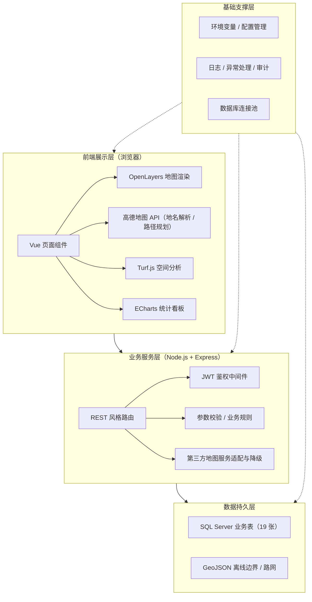

浦东新区公共医疗资源服务平台

基于WebGIS的区域公共医疗资源展示、分析与便民服务平台。系统将医疗点位、居民区、道路网络及业务数据统一组织到同一张数字地图中，形成从「查询资源」到「分析资源」、再到「辅助决策」的完整服务链条，同时面向居民提供就医导航、预约挂号、用药查询与健康管理等便民服务。
> 文档性质：项目验收说明材料 ｜ 适用对象：项目组成员、指导教师、项目验收人员 ｜ 编制版本：正式说明稿 ｜ 编制日期：2026 年 9 月

 目录
[项目简介](项目简介)
[核心功能](核心功能)
[系统架构](系统架构)
[技术栈](技术栈)
[用户角色与权限](用户角色与权限)
[快速开始](快速开始)
[环境与配置](环境与配置)
[免责声明](免责声明)
[已知不足与完善计划](已知不足与完善计划)
[验收与测试](验收与测试)
[参考资料与文档链接](参考资料与文档链接)
---

 项目简介

 建设背景

随着城市人口规模扩大、居民就医需求多样化以及公共卫生事件应急管理要求不断提高，区域医疗资源配置逐渐从「总量满足」转向「空间均衡、服务可达、动态协同」。浦东新区地域范围广、功能区类型多，人口分布和医疗资源分布具有明显的空间差异，传统文字列表或静态表格难以直观表达医疗设施与居民区、道路网络之间的空间关系，难以为医疗点位选址、服务覆盖评价和应急资源调配提供可视化依据。

 系统定位

- 便民就医服务工具：面向居民，帮助快速查找医疗机构、了解科室与医生信息、规划就医路径、查询药品和预约挂号。
- 资源规划决策支撑工具：面向管理部门，通过热力分析、选址评估和医疗韧性评估等空间分析功能，辅助识别服务覆盖不足区域和医疗资源配置薄弱环节。

 核心价值

| 价值维度 | 主要体现 | 预期作用 |
| --- | --- | --- |
| 资源可视化 | 将医院、社区卫生服务中心、急救站、药店及居民区等对象统一加载到地图中，支持分类筛选、点位详情和空间关系查看。 | 降低信息检索成本，提升医疗资源分布认知的直观性。 |
| 决策辅助化 | 提供热力分析、医疗韧性评估、选址评估和统计看板，形成可比较的指标与图表结果。 | 为资源补短板、设施增量建设和应急保障提供分析依据。 |
| 服务便民化 | 提供路径规划、医疗信息查询、预约挂号、药品查询、健康管理和 AI 就医咨询等服务。 | 缩短居民从「发现需求」到「获得服务」的操作链路。 |

 建设范围与边界
平台以浦东新区公共医疗资源为主要对象，当前建设范围包括：医疗点位地图展示、居民区关联分析、路径规划、热力分析、医疗韧性评估、选址评估、医疗信息库、预约挂号、药品数据库、健康管理、AI 就医咨询、公告管理、用户权限、收藏评价等功能。
- 地理数据：浦东新区边界与路网采用离线 GeoJSON 文件作为基础数据来源。
- 业务数据：医疗点位、用户、公告、收藏评价、预约等业务数据由 SQL Server 统一存储。
- 边界声明：本系统属于信息展示与分析辅助平台，AI 咨询、药品推荐、健康风险评估和空间评估结果均用于科普、查询或规划参考，不替代执业医师诊断、处方和行政审批结论。
---

 核心功能
平台共包含 10 大功能模块：

 1. 系统主页面与医疗资源可视化
统一工作台，集中承载地图底座、资源图层、筛选条件、统计看板和业务入口。支持图层开关、分类下拉框或关键词筛选（医院、社区卫生服务中心、急救站、药店），点击地图要素可查看名称、地址、电话、等级、服务类型等详情。

 2. 路径规划
支持地图单击选点或搜索框输入起点/终点，选择步行、驾车或公交出行方式生成就医路线，展示预计距离、预计耗时、换乘或道路提示。基于高德地图地理编码与路径规划 API 实现。

 3. 热力分析
以居民点为中心、按分析半径生成分析范围或热力图层，右侧面板展示范围内医疗点总数、各类型数量、平均距离或分级结果，并给出「便利、一般、偏弱」等就医便利度建议。

 4. 医疗韧性评估
识别医疗资源空间布局短板区域，评价区域医疗网络在突发公共卫生事件、就诊需求激增或局部设施受限情况下的承压、响应和恢复能力。指标体系包括覆盖率、空间均衡度、资源缺口系数、资源冗余或替代能力等，支持权重方案对比，补给分析采用贪心策略。

 5. 选址评估
在地图上单击候选位置或输入坐标，设置缓冲半径，分析周边点位总数、分类数量、到最近点距离、服务覆盖情况，输出「高度密集、适中、稀缺」三级选址建议，支持保存评估结果用于后续比较。

 6. AI 就医咨询与智能荐药
基于结构化知识库与规则词典，提供症状科普、就医方向和科室匹配建议；智能荐药在药品数据库范围内进行信息检索和规则匹配，先经过过敏史、禁忌症、年龄和特殊人群过滤。高风险描述（急性胸痛、严重呼吸困难、意识障碍等）优先提示立即线下就医。

 7. 医疗信息库与预约挂号
提供医院、科室、医生、出诊日历、排班和服务信息查询；支持选时段、提交预约、查看与取消预约，提交时对号源进行并发校验。医生账号可维护出诊时间、号源额度和停诊状态。

 8. 药品数据库
提供药品基础信息、适应症、禁忌症、注意事项、用法用量说明和药物相互作用查询；支持按名称、通用名、类别或适应症搜索，以及按年龄、过敏史、妊娠哺乳状态、慢病和禁忌症的智能筛选。

 9. 健康管理
形成用户个人健康档案，记录血压、血糖、体重、用药、既往史和随访信息，按日期展示趋势图，识别连续异常、波动增大或长期未记录等情况，生成低、中、高风险提示与个性化健康计划。

 10. 系统管理、公告、权限、收藏与评价
支持系统公告发布（增删改查/隐藏）、账号权限控制、医疗点位收藏和用户评价（星级+文字，管理员审核）。权限判断由后端执行，前端按钮隐藏仅作为交互优化。
---

 系统架构

系统采用「前端展示层 — 业务服务层 — 数据持久层 — 基础支撑层」的分层架构，各层通过明确的接口边界协同工作。

| 架构层 | 技术选型 | 核心组件 | 主要职责 |
| --- | --- | --- | --- |
| 前端展示层 | HTML、CSS、JavaScript、Vue | OpenLayers、高德地图、Turf.js、ECharts | 页面布局、地图渲染、图层管理、筛选交互、表单提交、图表展示和结果反馈。 |
| 业务服务层 | Node.js、Express、JWT | REST 风格路由、统一响应、权限中间件 | 提供医疗点位、公告、用户、预约、药品、健康管理和空间分析接口，执行参数校验、权限控制和业务规则。 |
| 数据持久层 | SQL Server、GeoJSON | 业务数据表、离线边界文件、离线路网文件 | 保存用户、医疗点位、公告、收藏评价、预约和健康记录（共 19 张业务表）；读取边界与道路等轻量空间数据。 |
| 基础支撑层 | Node.js 运行时、操作系统、网络服务 | 环境变量、日志、异常处理、数据库连接池 | 提供服务运行、配置管理、连接复用、错误追踪和基础安全保障。 |

 架构设计优势

- 解耦与并行开发：前后端通过稳定的 JSON/GeoJSON 接口协作，便于多人并行开发和接口联调。
- 地图能力互补：OpenLayers 负责多图层与空间要素控制，高德地图负责地名解析和路径服务。
- 空间分析可扩展：Turf.js 支持缓冲区、距离、面积和框选统计等轻量运算，后续可迁移至后端或空间数据库。
- 数据呈现清晰：ECharts 将点位统计、覆盖评价和评估建议转化为柱状图、饼图、雷达图或指标卡。
- 安全边界明确：认证、角色权限、输入校验、日志审计和敏感词过滤在业务服务层统一实现。
---

 技术栈

| 层级 | 技术 |
| --- | --- |
| 前端 | HTML、CSS、JavaScript、Vue |
| 地图与空间分析 | OpenLayers、高德地图 API、Turf.js |
| 可视化 | ECharts |
| 后端 | Node.js、Express、JWT |
| 数据库 | SQL Server（业务数据，19 张表） |
| 空间数据 | GeoJSON（离线边界、离线路网） |

---

 用户角色与权限

| 角色 | 权限范围 | 主要功能边界 |
| --- | --- | --- |
| 超级管理员 | 平台配置与管理权限 | 用户和角色管理、公告增删改查、药品和基础数据维护、敏感内容处理、日志审计与系统参数管理。 |
| 普通用户 | 居民服务权限 | 查看地图和公告、查询医疗信息、路径规划、收藏点位、提交评价、预约挂号和维护个人健康档案。 |
| 医生账号 | 医疗服务维护权限 | 维护个人简介、出诊日历和号源额度，查看授权范围内的预约患者信息，不能访问无关管理员配置。 |

---

 快速开始

> 说明：以下为通用部署步骤，具体命令、端口与配置文件以项目实际代码为准（系统说明文档未包含启动命令细节，标注项请在部署时补充）。

1. 环境准备：安装 Node.js 运行时与 SQL Server 数据库。
2. 获取外部服务：申请高德地图 API Key（地名解析、路径规划）。
3. 准备离线数据：放置浦东新区边界、路网 GeoJSON 文件。
4. 初始化数据库：执行数据库脚本创建业务表（共 19 张表）。
5. 配置环境变量：数据库连接串、JWT 密钥、跨域白名单、外部服务配置等。
6. 启动后端：启动 Express 服务，提供 REST 风格业务接口。
7. 启动前端：启动 Vue 前端页面，访问系统主页面。

---

 环境与配置

| 配置项 | 说明 | 备注 |
| --- | --- | --- |
| 数据库 | SQL Server | 存储医疗点位、用户、公告、收藏评价、预约、健康记录等业务数据 |
| 离线空间数据 | GeoJSON | 浦东新区边界、路网 |
| 地图服务 | 高德地图 API | 地名搜索、坐标解析、出行路径服务 |
| 鉴权 | JWT Bearer Token | 令牌包含用户 ID 和角色 |
| 敏感配置 | 环境变量 | 开发/验收环境分别配置不同密钥与数据库账号，避免敏感信息写入代码仓库 |

---

 免责声明

本系统属于信息展示与分析辅助平台。AI 咨询、药品推荐、健康风险评估和空间评估结果均用于科普、查询或规划参考，不替代执业医师诊断、处方和行政审批结论。系统结果属于规划辅助分析，不替代应急指挥部门的现场研判。

---

 已知不足与完善计划

 当前不足

| 问题类别 | 具体表现与影响 |
| --- | --- |
| 地理数据覆盖与时效不足 | 医疗点位和居民区样本覆盖有限，离线 GeoJSON 缺少自动更新和质量校验，道路改扩建、机构迁址等不能及时反映。 |
| 空间分析模型参数较为固定 | 依赖人工配置的指标和权重，人口密度、居民区规模、实际通行时间和不同人群需求尚未充分进入模型。 |
| AI 与智能荐药边界和稳定性限制 | 症状—药品映射词典覆盖范围有限，外部 AI 服务受网络、配额和密钥影响，异常时回退到本地规则。 |
| 并发能力和数据实时性不足 | 面向课程验收场景开发，未针对高并发优化，数据同步、缓存、索引和限流机制尚未形成生产级方案。 |
| 移动端适配能力不足 | 主要面向电脑浏览器，手机和平板上的触控、布局和信息密度仍需优化。 |
| 健康管理深度有限 | 以手动录入为主，未接入可穿戴设备，长期趋势、复查随访和多病共管能力有限。 |

 后续完善方向

| 优先级 | 优化方向 | 主要措施 |
| --- | --- | --- |
| P0 | 完善地理基础数据与人口数据 | 补充全量医疗资源、居民区及人口统计数据，建立数据来源、更新时间和质量检查记录。 |
| P0 | 建立安全与审计机制 | 完善各类操作日志，增加敏感词过滤、留言审核、密码强度校验、限流和角色级访问拦截，敏感字段脱敏。 |
| P1 | 优化空间评价模型 | 纳入人口密度、居民区规模、道路通行时间、医疗等级、服务容量和急救可达性，支持权重配置与结果导出。 |
| P1 | 增强数据实时性与系统性能 | 增加数据定时同步，为高频接口增加索引、缓存和分页，外部 API 设置超时、重试、熔断和降级。 |
| P1 | 增强 AI 模块的知识库与风险控制 | 扩充知识库，建立版本、来源和审核状态，急症关键词强提示，输出科普声明并保留人工复核入口。 |
| P2 | 强化移动端适配 | 重新设计地图控件、筛选面板和表单的移动布局，支持触摸缩放、定位和一键导航。 |
| P2 | 拓展健康管理闭环 | 预留穿戴设备和健康数据导入接口，增加长期趋势、复查提醒、慢病随访和异常消息推送。 |

---

 验收与测试

建议按照「功能可用、数据可信、权限有效、异常可控、结果可解释」的原则组织测试，至少覆盖：

- 功能覆盖：地图加载、点位筛选、路径规划、热力分析、韧性评估、选址评估、公告 CRUD、角色权限、预约流程和异常提示。
- 边界场景：空数据、无效参数、第三方地图服务不可用、未登录访问、普通用户越权和数据库连接失败等。
- 结论边界：对于 AI 咨询、智能荐药、健康风险和空间评估结果，应将「参考性质、适用条件和人工确认要求」作为验收材料中的明确说明，避免把原型系统的辅助结论表述为医疗诊断或正式规划审批结论。

---

 参考资料与文档链接

 官方技术文档

| 组件 | 用途 | 官方文档 |
| --- | --- | --- |
| Vue | 前端页面框架 | <https://cn.vuejs.org/> |
| OpenLayers | 地图渲染与图层管理 | <https://openlayers.org/> |
| 高德开放平台 | 地名解析、坐标转换、路径规划 | <https://developer.amap.com/> |
| Turf.js | 前端空间分析（缓冲区、距离、面积、统计） | <https://turfjs.org/> |
| ECharts | 统计看板与结果可视化 | <https://echarts.apache.org/zh/index.html> |
| Node.js | 后端运行环境 | <https://nodejs.org/zh-cn/> |
| Express | HTTP 服务与业务接口 | <https://expressjs.com/> |
| SQL Server | 业务数据存储 | <https://learn.microsoft.com/zh-cn/sql/sql-server/> |

 权威数据与政策来源

| 来源 | 说明 | 链接 |
| --- | --- | --- |
| 浦东新区人民政府 | 区域概况、规划与公开数据 | <https://www.pudong.gov.cn/> |
| 上海市卫生健康委员会 | 上海卫生健康政策、机构信息与便民服务 | <https://wsjkw.sh.gov.cn/> |
| 高德开放平台 · 路径规划 API | 系统路径规划能力对接文档 | <https://lbs.amap.com/api/webservice/guide/api/newroute> |

> 说明：以上链接均为官方或权威来源，接入外部服务时请以各站点最新发布内容为准；如需引用区域人口、机构名录等统计数据，请优先使用上述官方渠道的公开数据。

